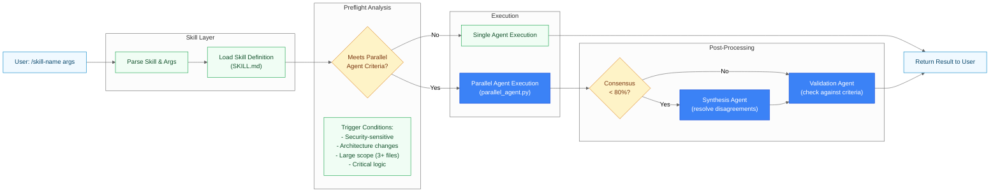
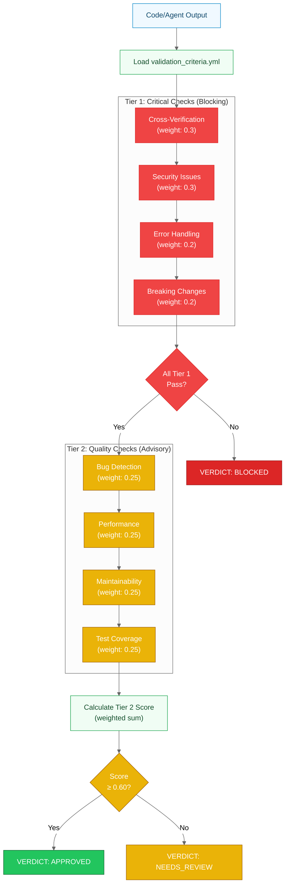
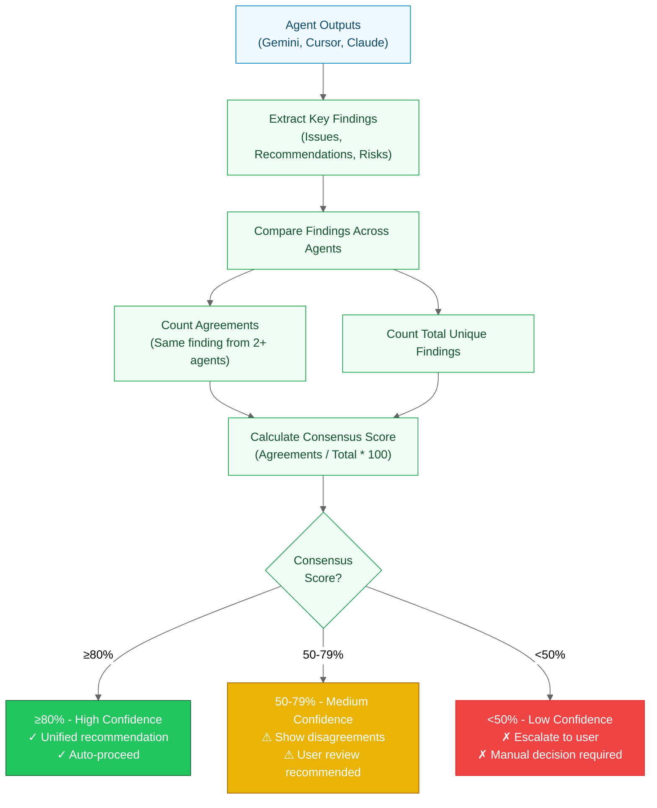

# Validation & Consensus

> How skills are processed and how agent output is scored into a verdict.

**Last Updated**: 2026-08-20

## Skill Processing Architecture

How slash commands (skills) are processed from user input to execution with parallel agent integration.



**Command Types**:

- **CONDITIONAL**: Refactor skills add independent review only for a trust-boundary
  change, destructive behavior, broad compatibility/deployment impact, unresolved
  uncertainty, or genuinely independent codebase-wide tracks
- **CONDITIONAL**: `/docs-generate-diagrams` (5+ modules), `/plan-manage` (complex planning),
  `/docs-improve` (500+ total doc lines)
- **NEVER Parallel**: `/docs-improve-readme` (straightforward documentation)

---

## Validation Pipeline

How code changes and agent outputs are validated against Tier 1 (critical) and Tier 2 (quality) criteria.



**Validation Verdicts**:

- **APPROVED**: All Tier 1 pass, Tier 2 ≥ 0.60 → Safe to proceed
- **NEEDS_REVIEW**: All Tier 1 pass, Tier 2 < 0.60 → Manual review recommended
- **BLOCKED**: Any Tier 1 fails → Changes rejected

**Command-Specific Overrides**:
Commands can override default thresholds in `validation_criteria.yml`:

```yaml
command_overrides:
  python-refactor:
    tier1:
      security_issues: 0.5  # Higher weight for Python security
  git-commit:
    tier2:
      test_coverage: 0.0    # Don't require tests for commits
```

---

## Cross-Verification Consensus

How agent outputs are compared and consensus scores are calculated for decision-making.



**Example Consensus Calculation**:

Given 3 of 5 agents with these findings (Gemini, Cursor, Claude shown for brevity):

- **Gemini**: [A, B, C, D]
- **Cursor**: [A, B, E]
- **Claude**: [A, C, F]

**Analysis**:

- Total unique findings: A, B, C, D, E, F = **6**
- Agreements (2+ agents):
  - A: all 3 agents shown ✓
  - B: Gemini + Cursor ✓
  - C: Gemini + Claude ✓
- Agreement count: **3**
- **Consensus Score**: 3/6 * 100 = **50%** (MEDIUM)

**Action**: Show disagreements (D, E, F are unique to single agents), recommend user review.

---

---

[← Architecture Diagrams](README.md)
